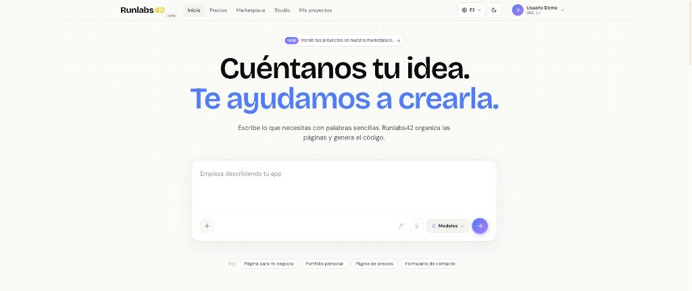
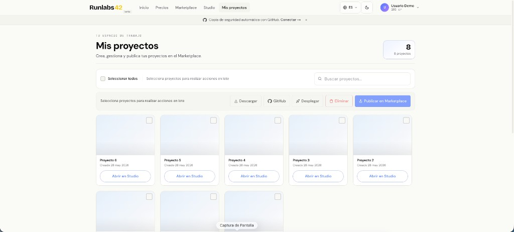
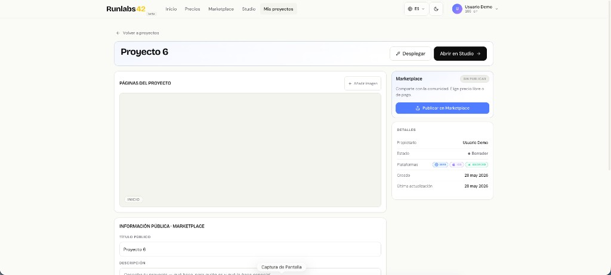
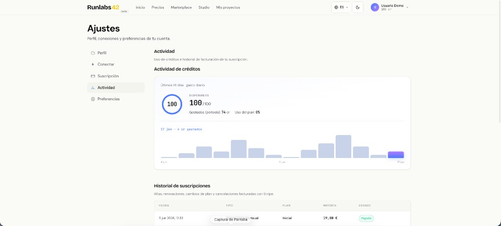
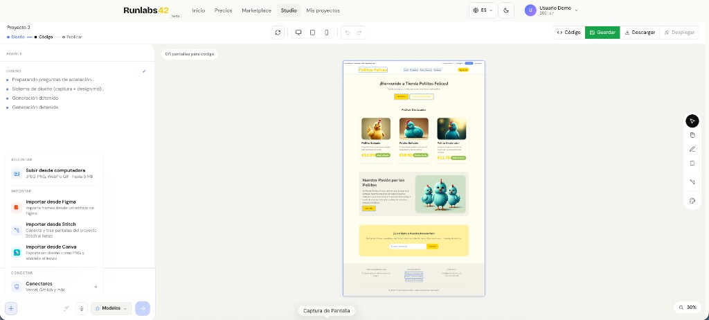
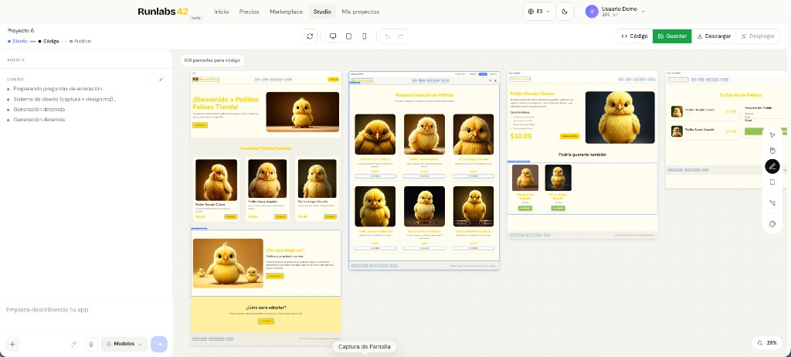

# runlabs42-saas

Aplicación SaaS basada en Next.js con Supabase como backend de datos y autenticación.

## Capturas

### Inicio



### Mis proyectos



### Detalle de proyecto



### Ajustes y créditos



### Studio — diseño



### Studio — pantallas generadas



## Instalación rápida

El proyecto incluye un **instalador interactivo** que configura todo lo necesario en local o producción.

```bash
git clone https://github.com/jmoraleses/runlabs42-saas.git
cd runlabs42-saas
./install.sh
```

También puedes usar:

```bash
pnpm setup
# equivalente a: node scripts/install.mjs
```

### ¿Qué hace el instalador?

1. Comprueba requisitos (Node 20+, pnpm, Docker en modo local).
2. Ejecuta `pnpm install`.
3. Te pregunta el entorno:
   - **Local** — levanta Supabase en Docker, aplica migraciones y rellena claves automáticamente.
   - **Producción** — pide URL y claves de tu proyecto Supabase en la nube.
4. Guía la configuración de API keys y secretos:
   - Supabase (`NEXT_PUBLIC_SUPABASE_URL`, anon key, service role)
   - IA (modo demo, Vertex AI o Gemini API Key)
   - Panel admin (`ADMIN_EMAILS`)
   - Stripe, Resend, OAuth (GitHub/Figma/Vercel), Stitch, Vercel Blob (opcionales)
5. Genera `.env.local` listo para usar.
6. En local, puede arrancar `pnpm dev` al finalizar.

### Requisitos previos

| Modo | Necesitas |
|------|-----------|
| **Local** | Node.js 20+, pnpm, Docker Desktop, Supabase CLI |
| **Producción** | Node.js 20+, pnpm, proyecto Supabase en la nube |

Plantilla de referencia: `.env.local.example` (sin secretos reales).

### Arranque manual (sin instalador)

```bash
pnpm install
cp .env.local.example .env.local   # edita con tus claves
pnpm dev
```

Servidor local: `http://localhost:3010`.

## Stack principal

- Next.js 14
- React 18
- Supabase (Auth + Postgres + migraciones SQL)
- Tailwind CSS

## Variables de entorno

No se incluyen secretos en el repositorio. Usa como base:

- `.env.local.example`

Los archivos `.env*` reales están ignorados por git. Usa `./install.sh` para generarlos de forma guiada.

## Supabase local (detalle)

Este proyecto puede correr contra Supabase local usando contenedores Docker. El instalador (`./install.sh`) automatiza estos pasos; si prefieres hacerlo a mano:

### 1) Requisitos

- Docker Desktop levantado
- Supabase CLI instalado

### 2) Inicializar/arrancar Supabase local

```bash
supabase init
supabase start
supabase status
```

`supabase start` levanta los servicios en Docker. Luego `supabase status` te muestra URL y claves locales.

### 3) Configurar variables locales

1. Copia el ejemplo:

```bash
cp .env.local.example .env.local
```

2. Rellena en `.env.local` los valores locales que imprime `supabase status` (anon key y publishable key).

Valores esperados para local:

- `NEXT_PUBLIC_SUPABASE_URL=http://127.0.0.1:54321`
- `SUPABASE_URL=http://127.0.0.1:54321`

### 4) Arrancar la app

```bash
pnpm dev
```

La configuración de CSP/imagenes ya permite `127.0.0.1:54321` y `localhost:54321` para no bloquear requests de Supabase local.

## Base de datos

Fuente oficial de esquema/migraciones:

- `supabase/migrations/`
- `supabase/apply-all.sql`
- `supabase/seed-marketplace.sql`

## Seguridad de publicación

Este repositorio ignora explícitamente:

- `.env*`
- `supabase/.temp/`
- `.kiro/`
- `.claude/`
