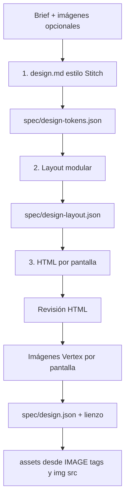
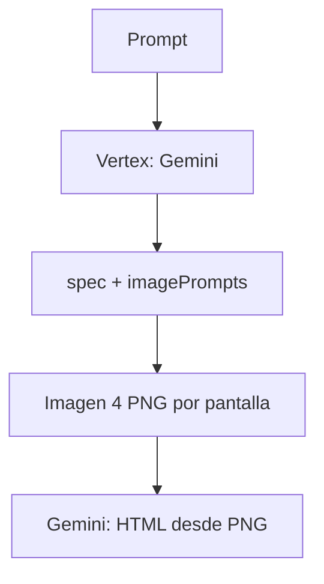
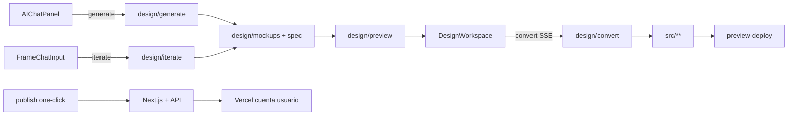

# Studio — Modo diseño (Canvas)

## Pipeline por defecto: orquestación modular

`POST /api/projects/[id]/design/generate` usa orquestación modular (`generateOrchestratedDesign`). Con **`DESIGN_AGENT_STUDIO_ENGINE`** configurado, tokens/layout/assets se delegan al agente ADK (`run_orchestration`); si falla o no está definido, el pipeline corre en Node vía Vertex Agent Platform. El **modelo** lo elige el usuario en el compositor (`body.model`). HTML + lienzo siempre en la app:



| Fase SSE (`phase`) | Salida | Descripción |
|--------------------|--------|-------------|
| `design-md` | `spec/design.md` | Sistema de diseño (YAML frontmatter + Brand & Style, Colors, Typography, Components…) estilo Google Stitch |
| `tokens-review` | `spec/design-tokens.json` | Tokens derivados del frontmatter y revisión de coherencia |
| `visual-identity` | *(legacy)* | Sustituido por `design-md` en orquestación in-process |
| `layout-planning` | `spec/design-layout.json` | Páginas y secciones no plantilla; reintento si patrón nav→hero→features |
| `content-generation` | `design/site/*.html`, `design/pages/*/index.html` | HTML por partes con SSE (`page-part:{id}:shell`, secciones, footer); persist parcial → evento `files` → preview en vivo |
| `page:{id}:html-review` | misma ruta HTML | Revisión visual LLM (screenshot + design.md); desactivar con `DESIGN_HTML_REVIEW=0` |
| `page-assets:{id}:{n}/{total}` | `assets/*.jpg`… | Imagen / Vertex **tras el HTML de esa pantalla** (y revisión si aplica), antes de la siguiente |

**Multimodal:** las imágenes de referencia y `designVisualReferencePrompt` se envían en **todas** las fases de texto (design.md, layout, HTML). Con captura adjunta, la fidelidad a la imagen **gana** sobre reglas anti-plantilla del layout (no se rechaza nav→hero→features si es lo que muestra la referencia).

**Brief estructurado** (opcional en body o UI del compositor):

```json
{
  "prompt": "Café artesanal con tienda online",
  "brief": {
    "siteType": "ecommerce",
    "brandTone": "orgánico premium",
    "businessModel": "B2C retail",
    "requiredSections": ["pricing", "testimonials"]
  },
  "images": [{ "mimeType": "image/png", "data": "<base64>" }],
  "device": "desktop",
  "stream": true
}
```

Si no se envía `brief`, se **infiere** del prompt (`inferDesignBriefFromPrompt`). Campos sueltos en el root (`siteType`, `brandTone`, …) también son válidos.

### Pautas del orquestador (diseño objetivo)

Ver **[ORQUESTADOR-PAUTAS-STITCH.md](./ORQUESTADOR-PAUTAS-STITCH.md)** — reglas derivadas del export Stitch (Tailwind + design.md M3, HTML monolítico, revisión por screenshot). Es la referencia para *cómo debe comportarse* el pipeline, independiente de scripts de benchmark.

### Paridad Google Stitch (flash-lite)

El orquestador activa **modo paridad Stitch por defecto** (Tailwind CDN + HTML monolítico + design.md en una pasada). Desactivar con `DESIGN_STITCH_PARITY=0`. Con referencia local:

- HTML **monolítico** (una llamada por pantalla), no shell + 6 secciones.
- Stack como export de Stitch: **Tailwind CDN** + `tailwind.config` con colores del YAML.
- `html-review` (activo por defecto) alinea captura + `design.md`; desactivar con `DESIGN_HTML_REVIEW=0` si quieres solo el primer pase HTML.

**Referencia desde tu cuenta Stitch** (MCP HTTP en `~/.cursor/mcp.json`):

```bash
npm run stitch:sync                    # → uploads/stitch-reference/{projectId}/
# Edita uploads/stitch-reference/.../prompt.txt con el prompt que usaste en Stitch
```

En la generación, pasa el id del proyecto:

```json
{
  "prompt": "Misma landing que en Stitch",
  "brief": {
    "stitchProjectId": "2510768920948183313",
    "stitchScreenId": "c41095306a6146ed9bd54a0c72fc5b32"
  }
}
```

La API de Stitch **no devuelve** el historial de prompts; hay que pegarlos en `prompt.txt`. Sí importa `design.md`, HTML y PNG de la pantalla.

Variables: `DESIGN_STITCH_PARITY=1|0`, `STITCH_REFERENCE_PROJECT`, `STITCH_REFERENCE_SCREEN`.

Archivos: `stitchParity.ts`, `stitchReference.ts`, `scripts/stitch-sync-reference.mjs`.

### Generar en Stitch y en Runlabs (mismo prompt)

La API MCP permite **crear proyectos** y **generar pantallas** (`generate_screen_from_text`, ~1–2 min). No devuelve el prompt histórico, pero sí HTML + PNG tras la generación.

```bash
# Ambos: Stitch + orquestador flash-lite
npm run stitch:dual -- "Landing para marca X, desktop"

# Solo Stitch o solo Runlabs
npm run stitch:dual -- "..." --stitch-only
npm run stitch:dual -- "..." --runlabs-only

# Añadir pantalla a un proyecto Stitch existente
npm run stitch:dual -- "..." --project=2510768920948183313
```

Salida en `uploads/dual-run-<timestamp>/` (`stitch-page.html`, `stitch-screenshot.png`, `runlabs-page.html`, `manifest.json`). También actualiza `uploads/stitch-reference/<projectId>/` para paridad en el orquestador.

Cliente: `src/lib/design/stitchMcpClient.ts`.

Archivos clave: `src/lib/design/orchestration.ts`, `orchestrationPrompts.ts`, `designBrief.ts`, `orchestrationLayout.ts`, `orchestrationAssets.ts`, `agentStudio/`.

### Agent Studio (opcional)

Despliega el agente ADK en `agents/design-orchestrator/` y configura:

```bash
DESIGN_AGENT_STUDIO_ENGINE=projects/TU_PROYECTO/locations/us-central1/reasoningEngines/TU_ENGINE_ID
# alias corto (solo ID):
VERTEX_DESIGN_REASONING_ENGINE=TU_ENGINE_ID
```

Ver `agents/design-orchestrator/README.md`. La fase HTML mantiene streaming directo a Vertex para el reveal progresivo en el lienzo.

### Pipeline HTML (incremental vs monolito)

Con **stream** (`send` en orquestación / `POST …/design/generate` con `stream: true`), el HTML se genera **por partes** y cada paso persiste en el proyecto → el lienzo recarga el iframe. El lienzo muestra aurora en las pantallas del plan que aún no tienen HTML; la pantalla en curso abre el iframe cuando llega el primer fragmento real. Tras ensamblar se ejecuta `page:{id}:html-review` con el **HTML completo**, **spec/design.md** íntegro y un **screenshot** del render (Playwright; desactivar con `DESIGN_HTML_REVIEW_SCREENSHOT=0`).

- `DESIGN_HTML_MONOLITH_FIRST=1` — fuerza monolito primero (sin preview por sección).
- Fases SSE de modo HTML (panel DISEÑO): `html-build:monolith`, `html-build:incremental`, `html-build:sequential-fallback`, `html-build:incomplete:…`, `page:{id}:html-failed:…`.
- Sin SSE: monolito + fallback por partes si el documento no es aceptable.

Si `orchestrate` se desactiva o `DESIGN_HTML_SEQUENTIAL=0`, vuelve el modo legacy fuera de orquestación. `DESIGN_PIPELINE=imagen` activa PNG de pantalla completa + HTML desde imagen.

## Pipeline legacy (Imagen pantalla completa)



1. **structure** → **mockups** → **analysis** → **html** (ver código en `finalizeStructureFiles`).

## Flujo en el lienzo



Tras `design/generate` se escribe **`spec/site-manifest.json`** (rutas, formularios, `requiresDatabase`).

1. **Diseño** — chat global genera mockups PNG (`design/mockups/`, `spec/design.json`).
2. **Iteración por frame** — regenera pantalla vía Imagen 4 (`design/iterate` actualiza `imagePrompt` + PNG).
3. **Mockups PNG** — edición visual DOM desactivada; usar prompt de regeneración por pantalla.
4. **Variantes** — Reimaginar → `design/variants/vN/{pageId}.png`.
5. **Convertir** — SSE `design/convert` con mockups PNG + spec → código en `src/**`.
6. **Referencia visual** — boceto/captura adjunta → Gemini multimodal en `design/generate` / `design/iterate`.
7. **Figma (MCP)** — intercambio de archivos vía [Figma MCP server](https://github.com/modelcontextprotocol/servers/tree/main/src/figma) + tool `export_design_mockups` en `/api/mcp`. OAuth/plugin opcional para flujos avanzados.

## Atajos en el lienzo

| Acción | Atajo |
|--------|--------|
| Zoom | ⌘/Ctrl + rueda |
| Pan | Espacio + arrastrar, o modo **Mover** en la barra inferior |
| Enfocar página | Doble clic en un frame en vista Lienzo |
| Reordenar elemento (HTML legacy) | Alt + ↑ / ↓ en modo Editar |
| Insertar bloque (HTML legacy) | Herramienta Rectángulo → texto o marco |

## APIs

| Ruta | Método | Descripción |
|------|--------|-------------|
| `/api/projects/[id]/design/generate` | POST | Orquestación modular (tokens → layout → assets → HTML). Body: `prompt`, `brief?`, `images?`, `device`, `stream` |
| `/api/projects/[id]/design/iterate` | POST | `{ prompt, pageId, brief?, images?, device }` — regenera PNG o HTML; usa tokens/layout del proyecto si existen |
| `/api/projects/[id]/design/reimagine` | POST | Variantes PNG o HTML |
| `/api/projects/[id]/design/apply-variant` | POST | `{ variantId, pageId? }` |
| `/api/projects/[id]/design/patch` | POST | Parche visual (solo HTML legacy) |
| `/api/projects/[id]/design/pages` | POST/PATCH/DELETE | CRUD páginas |
| `/api/projects/[id]/design/approve` | POST | Aprobar diseño |
| `/api/projects/[id]/design/convert` | POST | SSE → código Next.js App Router (usa `spec/site-manifest.json`) |
| `/api/projects/[id]/publish` | POST | SSE one-click: manifest → convert → backend → validate → deploy Vercel |
| `/api/projects/[id]/publish` | GET | `?deploymentId=` — estado del deploy en curso |
| `/api/projects/[id]/design/preview` | GET | Preview HTML o PNG |
| `/api/projects/[id]/design/preview/file/...` | GET | Assets y mockups PNG |
| `/api/projects/[id]/design/images` | POST | Referencia visual (Blob) |
| `/api/mcp` | POST | MCP incl. `export_design_mockups` |

## Variables de entorno (Vertex / diseño)

```bash
GOOGLE_APPLICATION_CREDENTIALS=...
GOOGLE_CLOUD_PROJECT_ID=...
GOOGLE_CLOUD_LOCATION=us-central1

DESIGN_GEN_MODEL=gemini-2.5-flash

# Agent Studio (opcional — fases tokens/layout/assets)
# DESIGN_AGENT_STUDIO_ENGINE=projects/.../reasoningEngines/...
# VERTEX_DESIGN_REASONING_ENGINE=engine-id

MOCKUP_GEN_MODEL=imagen-4.0-generate-001
MOCKUP_GEN_MODEL_FAST=imagen-4.0-fast-generate-001

# Assets dentro del HTML (heroes, productos): Imagen 4 por defecto (fast → standard)
IMAGE_GEN_MODEL=imagen-4.0-fast-generate-001
MOCKUP_GEN_MODEL=imagen-4.0-generate-001
MOCKUP_GEN_MODEL_FAST=imagen-4.0-fast-generate-001
IMAGE_GEN_PROVIDER=vertex
IMAGE_GEN_ALLOW_API_KEY=0
ALLOW_GEMINI_API_KEY_FALLBACK=0

# Pipeline pantalla completa PNG (legacy)
# DESIGN_PIPELINE=imagen

# Una sola respuesta Gemini con todo el HTML (sin paso a paso)
# DESIGN_HTML_SEQUENTIAL=0
```

Verificación local:

```bash
npm run check:vertex
# omitir smoke Imagen 4:
node scripts/check-vertex-env.mjs --skip-imagen-smoke
```

## Figma vía MCP

- Catálogo MCP en Ajustes → Integraciones → **Figma** enlaza al server oficial.
- Tool MCP `export_design_mockups` lista `design/mockups/*.png` y `spec/design.json`.
- Cliente MCP (Claude Code, etc.) lee/escribe archivos con `read_project_file` / `write_project_file`.

## Presets de dispositivo

| Preset | Ancho × Alto | aspectRatio Imagen |
|--------|----------------|---------------------|
| Móvil | 390 × 844 | 9:16 |
| Tablet | 768 × 1024 | 4:3 |
| Escritorio | 1280 × 720 | 16:9 |

## Migraciones

- `019_studio_design_preview.sql`
- `021_figma_integration.sql`

```bash
npx supabase db push --linked --yes
```
